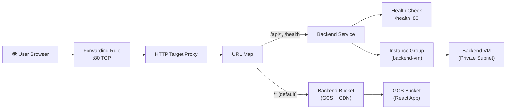

# 🌐 GCP Load Balancer — Manual Setup Guide (GCP Console UI)

> This guide recreates your Terraform load balancer config ([main.tf](file:///home/ratnapal/terraform-gcp/modules/load_balancer/main.tf)) step-by-step in the GCP Console.

---

## Architecture Overview



---

## Prerequisites (Must Exist Before Starting)

These resources must already be created before you set up the load balancer:

| Resource | Name | Where to Verify |
|---|---|---|
| GCS Bucket | `ratnapal-project-react-frontend` | Cloud Storage → Buckets |
| Backend VM | `backend-vm` | Compute Engine → VM Instances |
| VPC Network | Your VPC with private/public subnets | VPC Network → VPC Networks |

---

## Step 1: Reserve a Global Static IP Address

> [!IMPORTANT]
> This IP becomes your load balancer's public entry point. It's a **global** (anycast) IP, not regional.

1. Go to **VPC Network → IP addresses** (or search "External IP addresses" in the search bar)
2. Click **"+ RESERVE EXTERNAL STATIC ADDRESS"**
3. Fill in the form:

| Field | Value |
|---|---|
| **Name** | `ratnapal-lb-ip` |
| **Description** | *(leave blank)* |
| **Network Service Tier** | `Premium` *(default)* |
| **IP version** | `IPv4` |
| **Type** | `Global` |
| **Attached to** | `None` *(will attach later via forwarding rule)* |

4. Click **"RESERVE"**
5. **Note down the IP address** — you'll need it in Step 7

---

## Step 2: Create an Unmanaged Instance Group (Dependency for Backend Service)

> [!NOTE]
> The load balancer's backend service needs an instance group, not a raw VM. Since your Terraform uses an **unmanaged** instance group with a single VM, we create that first.

1. Go to **Compute Engine → Instance groups**
2. Click **"CREATE INSTANCE GROUP"**
3. At the top, select **"New unmanaged instance group"** (not managed)
4. Fill in the form:

| Field | Value |
|---|---|
| **Name** | `backend-vm-group` |
| **Description** | *(leave blank)* |
| **Location** | `Single zone` |
| **Region** | `us-central1` |
| **Zone** | `us-central1-a` |
| **Network** | *(select your VPC network)* |
| **Subnetwork** | *(select your **private** subnet)* |
| **VM instances** | Select `backend-vm` from the dropdown |

5. Under **"Port mapping"**, click **"+ ADD PORT"**:

| Port name | Port number |
|---|---|
| `http` | `80` |

6. Click **"CREATE"**

---

## Step 3: Create a Health Check

> [!IMPORTANT]
> The health check tells the load balancer whether your backend VM is alive. It hits `GET /health` on port 80 every 30 seconds.

1. Go to **Compute Engine → Health checks** (or search "Health checks" in the search bar)
2. Click **"+ CREATE HEALTH CHECK"**
3. Fill in the form:

| Field | Value |
|---|---|
| **Name** | `backend-vm-health-check` |
| **Description** | *(leave blank)* |
| **Scope** | `Global` *(for global LB)* |
| **Protocol** | `HTTP` |
| **Port** | `80` |
| **Proxy protocol** | `NONE` |
| **Request path** | `/health` |

4. Expand **"Health criteria"** section:

| Field | Value |
|---|---|
| **Check interval** | `30` seconds |
| **Timeout** | `10` seconds |
| **Healthy threshold** | `2` consecutive successes |
| **Unhealthy threshold** | `3` consecutive failures |

5. Under **"Logs"** → Leave **logging** as **Off**
6. Click **"CREATE"**

---

## Step 4: Create the Load Balancer (This Creates Everything Else)

> [!TIP]
> The GCP Console bundles **Backend Bucket**, **Backend Service**, **URL Map**, **Target Proxy**, and **Forwarding Rule** into one unified "Create Load Balancer" wizard. Steps 4A–4E are all within this single wizard.

1. Go to **Network services → Load balancing** (or search "Load balancing")
2. Click **"+ CREATE LOAD BALANCER"**
3. You'll see the load balancer type selection page:

### 4A — Choose Load Balancer Type

| Selection | Value |
|---|---|
| **Type of load balancer** | `Application Load Balancer (HTTP/HTTPS)` |
| Click **"NEXT"** | |
| **Public facing or internal** | `Public facing (external)` |
| Click **"NEXT"** | |
| **Global or single region deployment** | `Best for global workloads` → **Global external Application Load Balancer** |
| Click **"NEXT"** | |

4. Click **"CONFIGURE"**
5. Set the **Load balancer name**: `ratnapal-url-map`

> [!NOTE]
> In GCP, the load balancer name = the URL Map name. This matches your Terraform `google_compute_url_map.url_map.name`.

---

### 4B — Frontend Configuration

1. Click **"Frontend configuration"** in the left panel
2. Fill in:

| Field | Value |
|---|---|
| **Name** | `ratnapal-http-forwarding-rule` |
| **Description** | *(leave blank)* |
| **Protocol** | `HTTP` |
| **Network Service Tier** | `Premium` |
| **IP version** | `IPv4` |
| **IP address** | Select `ratnapal-lb-ip` *(the static IP you reserved in Step 1)* |
| **Port** | `80` |

3. Click **"Done"**

---

### 4C — Backend Configuration — Add Backend Bucket (React Frontend + CDN)

1. Click **"Backend configuration"** in the left panel
2. Click **"CREATE A BACKEND BUCKET"** (under the "Backend buckets" tab, or from the dropdown that says "Create or select backend services & backend buckets")
3. Fill in:

| Field | Value |
|---|---|
| **Name** | `frontend-backend-bucket` |
| **Description** | *(leave blank)* |
| **Cloud Storage bucket** | Click **"Browse"** → select `ratnapal-project-react-frontend` |
| **Enable Cloud CDN** | ✅ **Checked (ON)** |

4. After enabling CDN, configure **CDN Policy**:

| Field | Value |
|---|---|
| **Cache mode** | `Cache all static content` |
| **Client TTL** | `3600` seconds (1 hour) |
| **Default TTL** | `3600` seconds (1 hour) |
| **Maximum TTL** | `86400` seconds (24 hours) |
| **Serve while stale** | `86400` seconds (24 hours) |
| **Negative caching** | Leave as default (Off) |

5. Click **"CREATE"**

---

### 4D — Backend Configuration — Add Backend Service (Backend VM)

1. Still in **"Backend configuration"**, click the dropdown and select **"CREATE A BACKEND SERVICE"**
2. Fill in:

| Field | Value |
|---|---|
| **Name** | `backend-vm-service` |
| **Description** | *(leave blank)* |
| **Backend type** | `Instance group` |
| **Protocol** | `HTTP` |
| **Named port** | `http` |
| **Timeout** | `30` seconds |

3. Under **"Backends"** → click **"+ ADD BACKEND"**:

| Field | Value |
|---|---|
| **Instance group** | Select `backend-vm-group` (`us-central1-a`) |
| **Port numbers** | `80` |
| **Balancing mode** | `Utilization` |
| **Maximum backend utilization** | `80`% (0.8) |
| **Maximum RPS** | *(leave blank)* |
| **Capacity** | *(leave at 100%)* |

4. Click **"Done"** (on the backend entry)

5. Under **"Health check"** → select the health check you created: `backend-vm-health-check`

6. Expand **"Logging"** section:

| Field | Value |
|---|---|
| **Enable logging** | ✅ **Checked (ON)** |
| **Sample rate** | `0.5` (50% of requests are logged) |

7. Leave all other fields as defaults (no security policy, no session affinity, no connection draining override)

8. Click **"CREATE"**

---

### 4E — Routing Rules (URL Map Configuration)

> [!IMPORTANT]
> This is where you define path-based routing: `/api/*` → backend VM, everything else → GCS bucket (React app).

1. Click **"Routing rules"** in the left panel
2. Switch the mode to **"Advanced host and path rule"** (click the link/toggle)

3. **Host and path rules:**

   **Rule 1 — Default (React Frontend):**
   | Field | Value |
   |---|---|
   | **Hosts** | `*` (match all hosts) |
   | **Default backend** | `frontend-backend-bucket` |

   **Rule 2 — API paths:**
   Click **"+ ADD HOST AND PATH RULE"** or add a path rule under the same host:
   | Field | Value |
   |---|---|
   | **Path** | `/api/*` |
   | **Backend** | `backend-vm-service` |

   Click **"+ ADD PATH"** to add more paths under the same rule:
   | Field | Value |
   |---|---|
   | **Path** | `/api` |
   | **Backend** | `backend-vm-service` |

   Click **"+ ADD PATH"** one more time:
   | Field | Value |
   |---|---|
   | **Path** | `/health` |
   | **Backend** | `backend-vm-service` |

> [!TIP]
> The **path matcher name** (`allpaths`) is auto-generated by GCP. The important thing is that the path rules and default backend match what's shown above.

---

### 4F — Review and Create

1. Click **"Review and finalize"** in the left panel
2. Verify the summary shows:

```
Load Balancer:     ratnapal-url-map
Frontend:          ratnapal-http-forwarding-rule (HTTP:80, IP: <your static IP>)

Backend Bucket:    frontend-backend-bucket (CDN enabled)
                   → ratnapal-project-react-frontend

Backend Service:   backend-vm-service (HTTP, port: http)
                   → backend-vm-group (us-central1-a)
                   → Health check: backend-vm-health-check

Routing:           /api/*, /api, /health → backend-vm-service
                   /* (default)          → frontend-backend-bucket
```

3. Click **"CREATE"**

> [!NOTE]
> GCP will take 3–5 minutes to fully provision the load balancer. The health check may initially show the backend as **unhealthy** until the backend VM's `/health` endpoint responds on port 80.

---

## Summary of All Resources Created

| # | Resource Type | GCP Console Name | Terraform Equivalent |
|---|---|---|---|
| 1 | Global Static IP | `ratnapal-lb-ip` | `google_compute_global_address.lb_ip` |
| 2 | Unmanaged Instance Group | `backend-vm-group` | `google_compute_instance_group.backend_group` |
| 3 | Health Check | `backend-vm-health-check` | `google_compute_health_check.backend_health` |
| 4 | Backend Bucket (CDN) | `frontend-backend-bucket` | `google_compute_backend_bucket.frontend_backend` |
| 5 | Backend Service | `backend-vm-service` | `google_compute_backend_service.backend_service` |
| 6 | URL Map | `ratnapal-url-map` | `google_compute_url_map.url_map` |
| 7 | HTTP Target Proxy | `ratnapal-http-proxy` | `google_compute_target_http_proxy.http_proxy` |
| 8 | Forwarding Rule | `ratnapal-http-forwarding-rule` | `google_compute_global_forwarding_rule.http_rule` |

> [!WARNING]
> **Resources 6, 7, and 8** (URL Map, Target Proxy, Forwarding Rule) are created automatically by the GCP wizard in Step 4. You don't create them individually — the wizard bundles them together.

---

## Verification Checklist

After creation, verify everything works:

- [ ] **IP Address**: Go to **VPC Network → IP addresses** — `ratnapal-lb-ip` should show "In use by" the forwarding rule
- [ ] **Health Check**: Go to **Compute Engine → Health checks** → `backend-vm-health-check` should show **green** (healthy)
- [ ] **Load Balancer**: Go to **Network services → Load balancing** → Click your LB → verify all backends are healthy
- [ ] **Test Frontend**: Open `http://<your-static-IP>/` in browser → React app should load
- [ ] **Test API**: Open `http://<your-static-IP>/api/fastapi/docs` → FastAPI Swagger should load
- [ ] **Test Health**: `curl http://<your-static-IP>/health` → should return 200 OK

---

## ⚠️ Firewall Rule Reminder

> [!CAUTION]
> The load balancer health checks come from Google's IP ranges (`130.211.0.0/22` and `35.191.0.0/16`). Make sure your VPC has a **firewall rule** allowing ingress on **port 80** from these ranges to VMs tagged `backend-vm`. Without this, health checks will fail and the LB will mark your backend as unhealthy.

Check: **VPC Network → Firewall** → look for a rule allowing TCP:80 from `130.211.0.0/22, 35.191.0.0/16` to target tag `backend-vm`.
